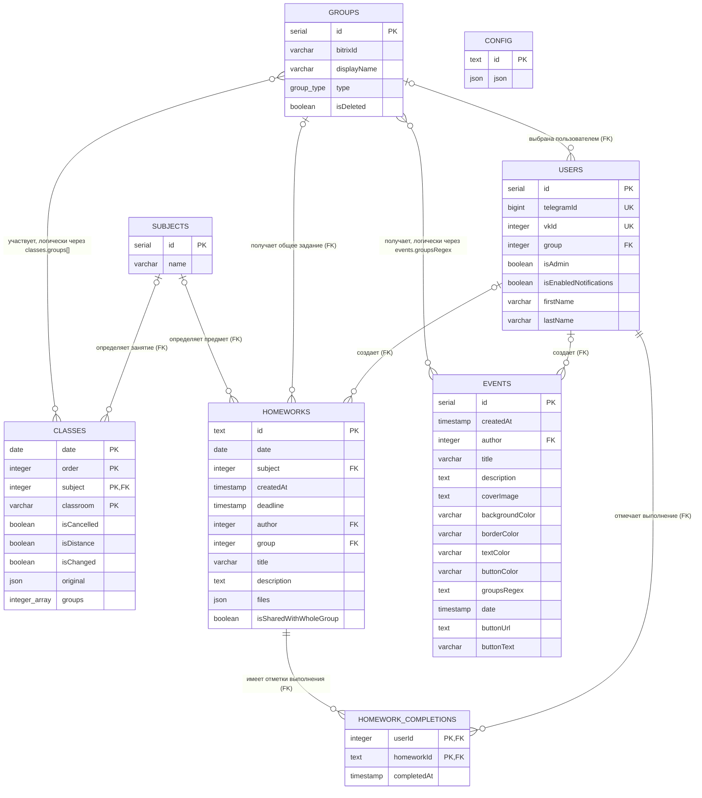

# Диаграмма взаимосвязей сущностей

Диаграмма построена по актуальной Drizzle-схеме из
`packages/drizzle/schema.ts`.

## Обозначения и особенности

- `PK` — первичный ключ, `FK` — внешний ключ, `UK` — уникальное поле.
- `group_type` принимает значения `teacher` и `studentsGroup`.
- `HOMEWORK_COMPLETIONS` реализует связь многие-ко-многим между
  пользователями и домашними заданиями.
- Связь `GROUPS` ↔ `CLASSES` логическая: ID групп хранятся в массиве
  `classes.groups`, поэтому PostgreSQL не контролирует ее внешним ключом.
- Связь `GROUPS` ↔ `EVENTS` логическая: событие выбирает группы через
  сопоставление `events.groupsRegex` с `groups.displayName`.
- `CONFIG` — самостоятельное key-value хранилище конфигурации без связей с
  другими таблицами.
