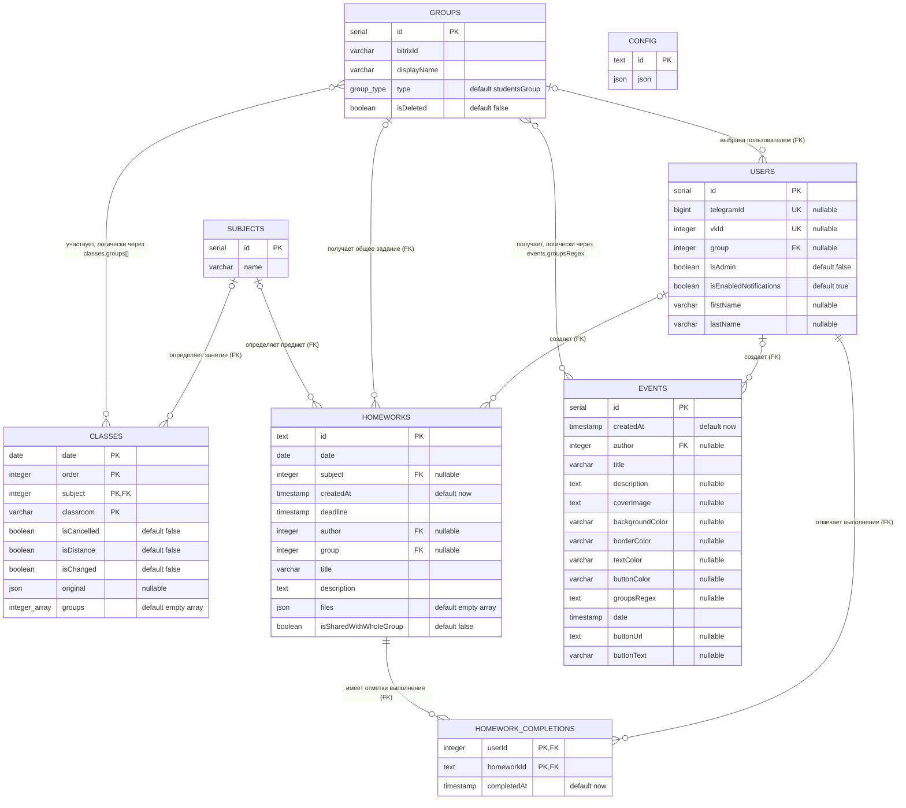

# Взаимосвязи сущностей

Источник истины — Drizzle-схема `packages/drizzle/schema.ts`. В диаграмме
показаны физические внешние ключи PostgreSQL и две логические связи, которые
приложение поддерживает без ограничений БД.

```mermaid
erDiagram
    GROUPS o|--o{ USERS : "выбрана пользователем (FK)"
    SUBJECTS o|--o{ CLASSES : "определяет занятие (FK)"
    USERS o|--o{ HOMEWORKS : "создает (FK)"
    GROUPS o|--o{ HOMEWORKS : "получает общее задание (FK)"
    SUBJECTS o|--o{ HOMEWORKS : "определяет предмет (FK)"
    USERS ||--o{ HOMEWORK_COMPLETIONS : "отмечает выполнение (FK)"
    HOMEWORKS ||--o{ HOMEWORK_COMPLETIONS : "имеет отметки выполнения (FK)"
    USERS o|--o{ EVENTS : "создает (FK)"
    GROUPS }o--o{ CLASSES : "участвует, логически через classes.groups[]"
    GROUPS }o--o{ EVENTS : "получает, логически через events.groupsRegex"

    CONFIG {
        text id PK
        json json
    }

    USERS {
        serial id PK
        bigint telegramId UK "nullable"
        integer vkId UK "nullable"
        integer group FK "nullable"
        boolean isAdmin "default false"
        boolean isEnabledNotifications "default true"
        varchar firstName "nullable"
        varchar lastName "nullable"
    }

    GROUPS {
        serial id PK
        varchar bitrixId
        varchar displayName
        group_type type "default studentsGroup"
        boolean isDeleted "default false"
    }

    SUBJECTS {
        serial id PK
        varchar name
    }

    CLASSES {
        date date PK
        integer order PK
        integer subject PK,FK
        varchar classroom PK
        boolean isCancelled "default false"
        boolean isDistance "default false"
        boolean isChanged "default false"
        json original "nullable"
        integer_array groups "default empty array"
    }

    HOMEWORKS {
        text id PK
        date date
        integer subject FK "nullable"
        timestamp createdAt "default now"
        timestamp deadline
        integer author FK "nullable"
        integer group FK "nullable"
        varchar title
        text description
        json files "default empty array"
        boolean isSharedWithWholeGroup "default false"
    }

    HOMEWORK_COMPLETIONS {
        integer userId PK,FK
        text homeworkId PK,FK
        timestamp completedAt "default now"
    }

    EVENTS {
        serial id PK
        timestamp createdAt "default now"
        integer author FK "nullable"
        varchar title
        text description "nullable"
        text coverImage "nullable"
        varchar backgroundColor "nullable"
        varchar borderColor "nullable"
        varchar textColor "nullable"
        varchar buttonColor "nullable"
        text groupsRegex "nullable"
        timestamp date
        text buttonUrl "nullable"
        varchar buttonText "nullable"
    }
```

## Обозначения и особенности

- `PK` — первичный ключ, `FK` — внешний ключ, `UK` — уникальное поле.
- Все поля без пометки `nullable` имеют ограничение `NOT NULL`.
- `group_type` принимает значения `teacher` и `studentsGroup`.
- `HOMEWORK_COMPLETIONS` реализует связь многие-ко-многим между
  пользователями и домашними заданиями.
- Связь `GROUPS` ↔ `CLASSES` логическая: ID групп хранятся в массиве
  `classes.groups`, поэтому PostgreSQL не контролирует ее внешним ключом.
- Связь `GROUPS` ↔ `EVENTS` логическая: событие выбирает группы через
  сопоставление `events.groupsRegex` с `groups.displayName`.
- `CONFIG` — самостоятельное key-value хранилище без связей с другими таблицами.
  Сейчас в нем находятся опубликованная и резервная схемы здания (`buildingScheme`,
  `buildingSchemeBackup`) и настройки экрана технических работ
  (`maintenanceMode`).
- Для внешних ключей не заданы каскадные действия: используются стандартные
  правила PostgreSQL/Drizzle при удалении и обновлении связанных записей.
